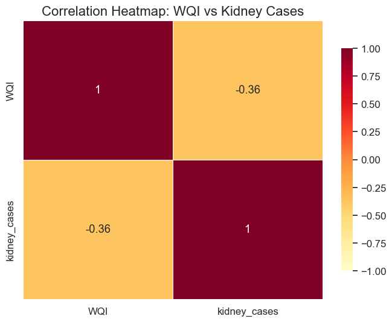

# 📊 Water Quality and Kidney Disease Correlation Analysis

<!-- 

  

 -->

---

## 📚 Project Overview
This project analyzes the relationship between **Water Quality Index (WQI)** and **kidney cases** across various Indian states. The goal is to visualize the correlation between water quality and kidney incidence using Python, Pandas, and Folium.

---

## 🗂️ Key Features
- 📈 Data cleaning, merging, and preprocessing using Pandas.
- 🔍 Visualizations using **scatter plots**, **correlation heatmaps**, and **Folium interactive maps**.
- ✅ Identified a **positive correlation coefficient of 0.39** between WQI and kidney cases.
- 🌐 Created a **geospatial Folium map** to display the geographic distribution of kidney cases and water pollution levels.
- 📀 Saved the Folium map as an interactive HTML file to analyze data for **each state of India** in a browser-based, zoomable map.

---

## 🛠️ Tools & Technologies
- Python
- Pandas
- Matplotlib
- Seaborn
- Folium
- GitHub

---

## 📂 Dataset
- **WQI Dataset:** Water Quality Index values by state.
- **Cancer Dataset:** Number of kidney cases by state.
- Merged on the `state` column for unified analysis.

---

## 📊 Visualizations

### Scatter Plot

### Correlation Heatmap

### Folium Map Visualization

The Folium map helps in **analyzing the WQI and kidney case data for every state in India through an interactive map**.

📂 **The Folium map is saved as an HTML file**, which can be opened in any web browser for an interactive, zoomable view of each state.

---

## ✅ Key Learnings
- Dataset merging and cleaning
- Visual storytelling with scatter plots and heatmaps
- Geospatial visualization using Folium
- GitHub project documentation and version control

---

## 🚀 How to Run
1. Clone the repository.
2. Run the Python scripts to generate visualizations.
3. Open `kidney_map.html` & ` to explore the interactive Folium map of every Indian state.

---

## 📌 Project Status
✔️ Completed  
✔️ Visualizations and Folium map generated successfully.  
✔️ Available for further feature enhancements.

## Results
The visualizations suggest a negative correlation between worsening water quality and increasing kidney cases in certain regions.

## Author
[Urvas Mohanty](https://github.com/UrvasMohanty)